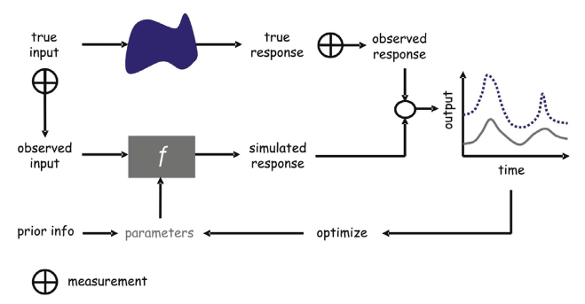
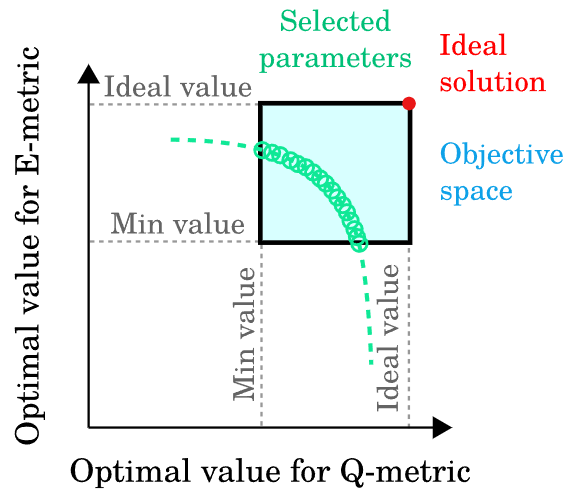
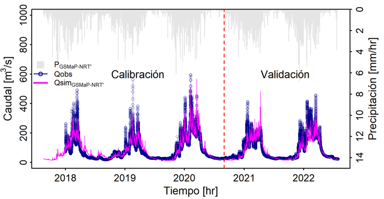

Models aim to represent hydrological systems using different kinds of mathematical simplifications, such as physically based, conceptual, or empirical approaches, as well as different spatial discretization schemes, including distributed, semi-distributed, and lumped models. These models can estimate the hydrological response of a system, commonly expressed in terms of streamflow, from changes in forcing variables such as precipitation.

However, uncertainties are inherent in hydrological modeling and may arise from different sources, including model forcings ($u$), parameters ($\theta$), states ($X$), structure ($M$), and outputs ($Y$), as described by Liu and Gupta (2007). Moreover, model errors ($\varepsilon$) directly affect streamflow simulations because they propagate through the modeling system, from inputs to outputs. This can be represented as follows, where *t* denotes time:

$$
Y_{t} = M(u_{t}, X_{t-1}, \theta, \varepsilon)
$$

In this context, model calibration techniques help reduce parameter uncertainty and improve the representation of streamflow.

------------------------------------------------------------------------

### Model optimization

The main objective of model optimization is to reduce the differences between observed and simulated responses of the hydrological system through parameter adjustment, as described by Vrugt et al. (2013).

{width="600"}

This objective can be expressed as a **minimization problem**, where the cost function $J$ represents the error between simulations ($Y_{sim}$) and observations ($Y_{obs}$):

$$
\min J = \varepsilon(Y_{sim} - Y_{obs})
$$

The cost function is commonly referred to as the **objective function** (*OF*). It can be expressed using statistical metrics such as the Root Mean Square Error (*RMSE*), where $n$ represents the length of the time series and $i$ is the time step.

$$
\min OF = \min RMSE =
\min \left(
\sqrt{
\frac{1}{n}
\sum_{i=1}^{n}
\left(Y_{sim,i} - Y_{obs,i}\right)^2
}
\right)
$$

Other statistical metrics are widely used in model calibration, such as the Nash--Sutcliffe Efficiency (*NSE*) and the Kling--Gupta Efficiency (*KGE*). In both cases, values close to 1 indicate a very good agreement between simulations and observations. Therefore, when these metrics are used as objective functions, the *OF* is commonly formulated as a maximization problem:

$$
\max NSE =
\max \left(
1 -
\frac{
\sum_{i=1}^{n}
\left(Y_{sim,i} - Y_{obs,i}\right)^2
}{
\sum_{i=1}^{n}
\left(Y_{obs,i} - \overline{Y}_{obs}\right)^2
}
\right)
$$

$$
\max KGE =
\max \left(
1 -
\sqrt{
(r - 1)^2 +
\left(\frac{\sigma_{sim}}{\sigma_{obs}} - 1\right)^2 +
\left(\frac{\mu_{sim}}{\mu_{obs}} - 1\right)^2
}
\right)
$$

Statistical metrics help quantify the agreement between observed and simulated discharges. For example, Ferreira et al. (2020) evaluated 36 objective functions proposed in the literature and confirmed that each metric should be interpreted according to the specific aspect it was designed to assess, such as low flows, high flows, timing, or overall performance. In R, several goodness-of-fit functions for comparing simulated and observed hydrological time series are available in the [hydroGOF](https://cran.r-project.org/web/packages/hydroGOF/index.html) package.

### Single-objective and multi-objective calibration

Hydrological model calibration can be performed using either a **single-objective** or a **multi-objective** approach.

In **single-objective calibration**, the optimization process is guided by one objective function. This objective function may be a single performance metric, such as RMSE, NSE, or KGE, or a weighted combination of several metrics. The aim is to identify one parameter set that provides the best overall performance according to the selected criterion.

For example, a single-objective function may combine different metrics as follows:

$$
\min OF(\theta) =
a \cdot RMSE(\theta) +
b \cdot (1 - NSE(\theta)) +
c \cdot (1 - KGE(\theta))
$$

where $\theta$ represents the model parameter set, and $a$, $b$, and $c$ are weights assigned to each metric. This approach is useful when the modeler has a clear priority, such as reducing peak-flow errors, improving the overall water balance, or maximizing agreement between observed and simulated streamflow.

However, hydrological models often need to represent several aspects of catchment behavior at the same time. For instance, a model may reproduce high flows well but perform poorly during low-flow periods, or it may capture the water balance but fail to represent flood peaks accurately.

In these cases, **multi-objective calibration** can be more appropriate. Instead of optimizing a single objective function, the calibration problem is formulated as the simultaneous optimization of several objective functions:

$$
\min F(\theta) =
\left[
f_1(\theta), f_2(\theta), \ldots, f_m(\theta)
\right]
$$

where $F(\theta)$ is a vector of objective functions, $m$ is the number of objectives, and each $f_j(\theta)$ evaluates a specific aspect of model performance.

For example, a multi-objective calibration problem may seek to minimize errors in high flows, low flows, and water balance simultaneously:

$$
\min F(\theta) =
\left[
RMSE_{high}(\theta),
RMSE_{low}(\theta),
|PBIAS(\theta)|
\right]
$$

Alternatively, when using efficiency metrics that should be maximized, such as NSE and KGE, the problem can be transformed into a minimization problem as follows:

$$
\min F(\theta) =
\left[
1 - NSE(\theta),
1 - KGE(\theta),
|PBIAS(\theta)|
\right]
$$

A solution $\theta_a$ is said to dominate another solution $\theta_b$ when it performs at least as well in all objectives and better in at least one objective:

$$
f_j(\theta_a) \leq f_j(\theta_b) \quad \forall j = 1, \ldots, m
$$

and

$$
f_j(\theta_a) < f_j(\theta_b) \quad \text{for at least one objective } j
$$

The set of non-dominated solutions forms the **Pareto front**. These solutions represent trade-offs between competing objectives. In other words, improving one objective would lead to the deterioration of at least one other objective.

For example, a calibration strategy may seek to improve both streamflow ($Q$) and evaporation ($E$) simulations, as discussed by Yeste et al. (2023):

$$
\min F(\theta) =
\left[
OF_Q(\theta),
OF_E(\theta)
\right]
$$

where $OF_Q(\theta)$ measures the error in streamflow simulations and $OF_E(\theta)$ measures the error in evaporation simulations. This type of approach is especially useful when the model is intended to support multiple applications, such as flood forecasting, drought analysis, water balance assessment, or climate impact studies.

{width="400"}

------------------------------------------------------------------------

### Optimization algorithms

Searching for the optimal set of model parameters can be a challenging task. The Shuffled Complex Evolution algorithm, commonly known as SCE-UA, is one of the most popular methods for single-objective and global automatic calibration of hydrological model parameters. According to Duan et al. (1993), the SCE-UA method is based on a synthesis of four concepts that have proven successful for global optimization: (a) a combination of probabilistic and deterministic approaches; (b) clustering; (c) systematic evolution of a complex of points spanning the parameter space in the direction of global improvement; and (d) competitive evolution.

The following list presents some functions and packages available in R for the optimization of hydrological models:

- [sceua](https://www.rdocumentation.org/packages/rtop/versions/0.6-6/topics/sceua): single-objective calibration function using the Shuffled Complex Evolution algorithm.

- [hydroPSO](https://www.rdocumentation.org/packages/hydroPSO/versions/0.3-1-1/topics/hydroPSO): enhanced Particle Swarm Optimization (PSO) algorithm.

- [ga](https://www.rdocumentation.org/packages/GA/versions/3.2.3/topics/ga): maximization of a fitness function using Genetic Algorithms (GA).

- [dream](https://r-forge.r-project.org/projects/dream): DiffeRential Evolution Adaptive Metropolis (DREAM), an efficient global MCMC algorithm even in high-dimensional spaces.

- [nsga2R](https://www.rdocumentation.org/packages/nsga2R/versions/1.1/topics/nsga2R): multi-objective calibration using the R-based Non-dominated Sorting Genetic Algorithm II.

- [rmoo](https://cran.r-project.org/web/packages/rmoo/index.html): framework for multi-objective and many-objective optimization, providing flexibility in parameter configuration, as well as tools for analysis, replication, and visualization of results.

- [caRamel](https://github.com/fzao/caRamel): R package for optimization implementing a multi-objective evolutionary algorithm that combines the MEAS algorithm and the NSGA-II algorithm.

- [GPareto](https://cran.r-project.org/web/packages/GPareto/index.html): package for multi-objective optimization using Expected Improvement and Step-wise Uncertainty Reduction sequential infill criteria.

------------------------------------------------------------------------

### Calibration and validation

Hydrological models usually require two main steps before operational implementation: calibration and validation. The **calibration** step consists of selecting a time window in which optimal model parameters are identified through the procedure described above. The **validation** step consists of applying this optimal parameter set to a different, independent time window that was not used during calibration.

In this sense, model performance is assessed during both calibration and validation periods using different statistical metrics.

{fig-align="center" width="500"}

The **warm-up** period is an additional step commonly used in model calibration to reduce uncertainty related to initial conditions. For instance, in daily models, the first year of the calibration period is often discarded from the objective function and statistical performance metrics to make model outputs less dependent on the initial model states.

------------------------------------------------------------------------

### References

Duan, Q. Y., V. K. Gupta, and S. Sorooshian. 1993. "Shuffled Complex Evolution Approach for Effective and Efficient Global Minimization." *Journal of Optimization Theory and Applications* 76 (3): 501--21. <https://doi.org/10.1007/BF00939380>.

Ferreira, Paloma Mara de Lima, Adriano Rolim da Paz, and Juan Martín Bravo. 2020. "Objective Functions Used as Performance Metrics for Hydrological Models: State-of-the-Art and Critical Analysis." *RBRH* 25. <https://doi.org/10.1590/2318-0331.252020190155>.

Liu, Yuqiong, and Hoshin V. Gupta. 2007. "Uncertainty in Hydrologic Modeling: Toward an Integrated Data Assimilation Framework." *Water Resources Research* 43 (7): 160. <https://doi.org/10.1029/2006WR005756>.

Vrugt, Jasper A., Cajo J. F. ter Braak, Cees G. H. Diks, and Gerrit Schoups. 2013. "Hydrologic Data Assimilation Using Particle Markov Chain Monte Carlo Simulation: Theory, Concepts and Applications." *Advances in Water Resources* 51 (January): 457--78. <https://doi.org/10.1016/j.advwatres.2012.04.002>.

Yeste, Patricio, Lieke A. Melsen, Matilde García-Valdecasas Ojeda, Sonia R. Gámiz-Fortis, Yolanda Castro-Díez, and María Jesús Esteban-Parra. 2023. "A Pareto-Based Sensitivity Analysis and Multiobjective Calibration Approach for Integrating Streamflow and Evaporation Data." *Water Resources Research* 59 (6). <https://doi.org/10.1029/2022WR033235>.